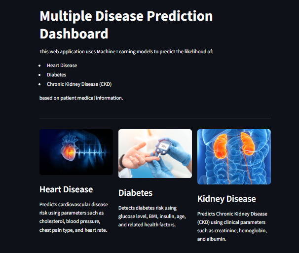
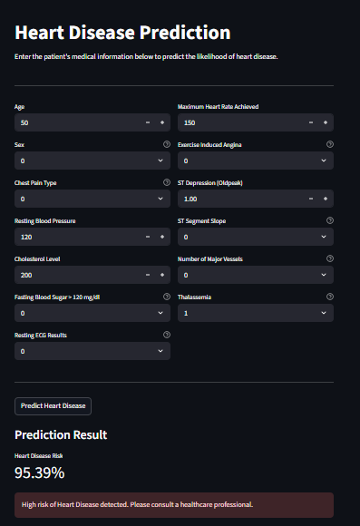
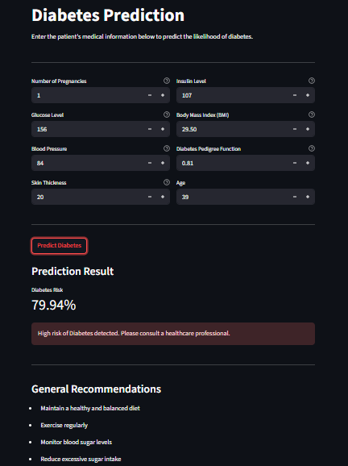
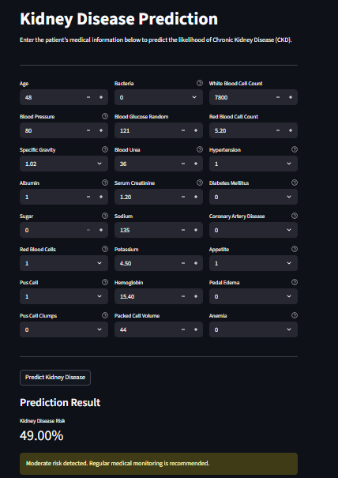
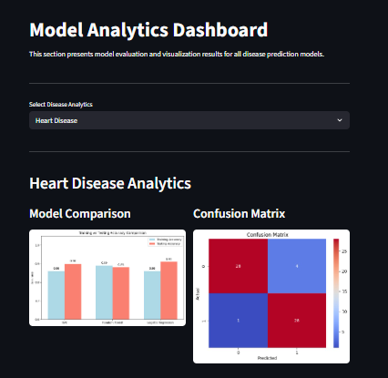

# 🩺 Multiple Disease Prediction System using Machine Learning

##  Problem Statement

Chronic diseases such as heart disease, diabetes, and kidney disease are among the leading causes of health risks worldwide. Early prediction can significantly improve treatment outcomes.

Traditional diagnostic methods require medical expertise and time, making early screening difficult for common users.

This project applies Machine Learning to enable early prediction of multiple diseases using clinical data.

---

## 💡 Solution Overview

The Multiple Disease Prediction System is an end-to-end machine learning web application that predicts the risk of:

-  Heart Disease  
-  Diabetes  
-  Chronic Kidney Disease  

It provides real-time predictions through an interactive Streamlit dashboard.

---

## Key Features

- Multi-disease prediction in a single system  
- Real-time ML-based predictions  
- Interactive Streamlit dashboard  
- Model analytics with visual insights  
- Risk level classification (Low / Moderate / High) 
- End-to-end deployed ML system  

---

##  Machine Learning Models Used

-  Heart Disease: Logistic Regression  
-  Diabetes: Stacking Classifier  
-  Kidney Disease: Tuned Random Forest  

---

##  Problem Type

- Supervised Machine Learning Classification  
- Individual binary classification models for each disease  

Targets:
- Heart Disease → target (0/1)  
- Diabetes → Outcome (0/1)  
- Kidney Disease → classification (0/1)  

---

## 📊 Features Considered

###  Heart Disease
- Age, Sex, Chest Pain Type  
- Blood Pressure, Cholesterol  
- Max Heart Rate, ST Depression  
- Exercise Angina, Thal, CA  

###  Diabetes
- Glucose Level, Blood Pressure  
- BMI, Insulin  
- Skin Thickness, Age  
- Diabetes Pedigree Function  

###  Kidney Disease
- Blood Urea, Creatinine  
- Hemoglobin, Sodium, Potassium  
- Red & White Blood Cells  
- Hypertension, Diabetes Mellitus  
- Appetite, Anemia, Pedal Edema  

---

##  Machine Learning Pipeline

1. Data Collection  
2. Data Cleaning & Preprocessing  
3. Exploratory Data Analysis (EDA)  
4. Feature Engineering  
5. Model Training  
6. Hyperparameter Tuning  
7. Model Evaluation  
8. Deployment using Streamlit  

---

## 📈 Model Performance

- Heart Disease: ~86% Test Accuracy (Logistic Regression)  
- Diabetes: Best performance using Stacking Classifier  
- Kidney Disease: ~99% Test Accuracy (Tuned Random Forest)  

---

##  Technologies Used

- Python  
- Streamlit  
- Scikit-learn  
- XGBoost  
- CatBoost  
- Pandas  
- NumPy  
- Matplotlib  
- Seaborn  
- Joblib  
- Git & GitHub  
- Render (Deployment)

---

## Project Screenshots

###  Home Page

###  Prediction Page



### Model Analytics Dashboard



## 📁 Project Structure

```
Multiple-Disease-Prediction/
│
├── app.py
├── saved_models/
│   ├── heart.joblib
│   ├── diabetes.joblib
│   ├── kidney.joblib
│   ├── diabetes_scaler.joblib
│   └── kidney_scaler.joblib
├── images/
├── requirements.txt
└── README.md
```

## How to Run Locally

``` bash
git clone https://github.com/your-username/multiple-disease-prediction.git
cd multiple-disease-prediction
pip install -r requirements.txt
streamlit run app.py
```

## Future Improvements
- Integration with real hospital datasets
- AI-based medical report analysis
- Cloud database storage for patient history
- Mobile application version
- API integration for hospitals


## About Me
Electronics and Computer Engineering undergraduate with strong interest in Machine Learning, Data Science, and Software Development. Experienced in building end-to-end ML projects involving data preprocessing, model training, and deployment using Streamlit. Skilled in Python, Java, and working with real-world datasets.


## 🌐 Live Demo
👉 [Click here to open the app](https://multiple-disease-prediction-2r7k.onrender.com)


##  Project Impact
This system demonstrates how Machine Learning can be applied in healthcare for early disease prediction. It combines multiple models into a single interactive platform, showcasing a complete end-to-end ML pipeline from data processing to deployment.
